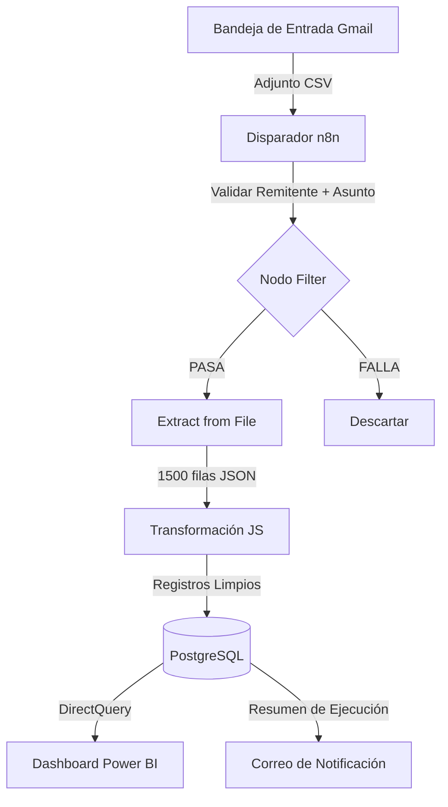

# Automated-Business-Intelligence-ETL-Platform

Plataforma automatizada de ETL y BI que extrae datos, los procesa con flujos en n8n (ETL), los almacena en una base de datos relacional (PostgreSQL) y los visualiza en Power BI. Simula una arquitectura de datos real para análisis y reporting empresarial.

> Pipeline de BI de extremo a extremo: ingesta automatizada de CSV desde Gmail → transformación en JavaScript → UPSERT en PostgreSQL → dashboard ejecutivo en Power BI. Cero pasos manuales.

---

## Descripción General del Proyecto

---

## Problema de Negocio

Una red de concesionarios de motos Honda en **5 estados de India** no contaba con un sistema centralizado de reportes. Los gerentes regionales enviaban archivos CSV de forma ad-hoc por correo electrónico, y un analista dedicaba ~40 horas/mes a consolidarlos manualmente en Excel antes de poder realizar cualquier análisis.

| Punto de Dolor | Impacto |
|---|---|
| Consolidación manual de CSV | ~40 horas de analista / mes |
| Latencia de reportes | 3 días de retraso hasta la visibilidad ejecutiva |
| Tasa de registros duplicados | 15–20% por fusión manual de archivos |

Las decisiones de negocio sobre inventario, promociones financieras y venta cruzada de seguros se tomaban sobre **₹37.41M en ventas** con 3 días de antigüedad.

---

## Solución

| Paso | Herramienta | Acción |
|---|---|---|
| Disparador | Gmail API / OAuth2 | Detectar nuevo correo con adjunto CSV |
| Validar | Nodo Filter de n8n | Lista blanca de remitentes + regex de asunto |
| Extraer | Nodo Extract from File de n8n | Decodificación Base64 → más de 1.500 filas JSON |
| Transformar | Nodo JavaScript Code | Eliminación de nulos, conversión de tipos, normalización de fechas |
| Cargar | PostgreSQL | `INSERT ... ON CONFLICT DO UPDATE` (idempotente) |
| Notificar | Gmail | Correo con resumen de ejecución (filas ingresadas / actualizadas / omitidas) |

---

## Arquitectura

---

## Stack Tecnológico

| Capa | Tecnología |
|---|---|
| Orquestación | n8n (auto-hospedado) |
| Fuente | Gmail API / OAuth2 |
| Transformación | JavaScript |
| Almacenamiento | PostgreSQL 15 |
| Visualización | Power BI |
| Infraestructura | Docker Compose |

---

## Esquema de Base de Datos

Esquema en estrella con 1 tabla de hechos, 3 dimensiones, 1 tabla de auditoría y vistas de capa semántica consumidas por Power BI.
