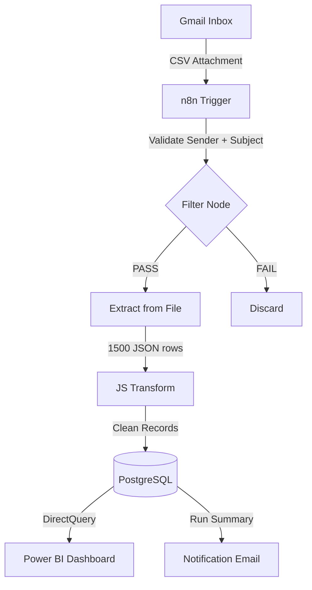

# Automated-Business-Intelligence-ETL-Platform
Plataforma automatizada de ETL y BI que extrae datos, los procesa con flujos en n8n (ETL), los almacena en una base de datos relacional (PostgreSQL) y los visualiza en Power BI. Simula una arquitectura de datos real para análisis y reporting empresarial.


> End-to-end BI pipeline: automated CSV ingestion from Gmail → JavaScript transformation → PostgreSQL UPSERT → Power BI executive dashboard. Zero manual steps.

---

## Dashboard Preview


---

## Business Problem

A Honda motorcycle dealership network across **5 Indian states** had no centralized reporting system. Regional managers emailed CSV files ad-hoc, and an analyst spent ~40h/month consolidating them manually into Excel before any analysis could happen.

| Pain Point | Impact |
|---|---|
| Manual CSV consolidation | ~40 analyst hours / month |
| Reporting latency | 3-day lag to executive visibility |
| Duplicate record rate | 15–20% from manual file merging |

Business decisions on inventory, finance promotions, and insurance cross-sell were being made on **₹37.41M in sales** that was 3 days stale.

---

## Solution

| Step | Tool | Action |
|---|---|---|
| Trigger | Gmail API / OAuth2 | Detect new email with CSV attachment |
| Validate | n8n Filter node | Sender whitelist + subject regex |
| Extract | n8n Extract from File | Base64 decode → 1,500+ JSON rows |
| Transform | JavaScript Code node | Null removal, type casting, date normalization |
| Load | PostgreSQL | `INSERT ... ON CONFLICT DO UPDATE` (idempotent) |
| Notify | Gmail | Run summary email (rows in / upserted / skipped) |

---

## Architecture



---

## Tech Stack

| Layer | Technology |
|---|---|
| Orchestration | n8n (self-hosted) |
| Source | Gmail API / OAuth2 |
| Transform | JavaScript |
| Storage | PostgreSQL 15 |
| Visualization | Power BI |
| Infrastructure | Docker Compose |

---

## Database Schema

Star schema with 1 fact table, 3 dimensions, 1 audit table, and semantic layer views consumed by Power BI.

| Object | Type | Description |
|---|---|---|
| `sales_orders` | Fact | Transaction grain — one row per order |
| `dim_products` | Dimension | Bike model catalog |
| `dim_geography` | Dimension | State / region / tier |
| `dim_payment` | Dimension | Payment mode metadata |
| `pipeline_runs` | Audit | Every run logged with row counts + status |
| `vw_monthly_kpis` | View | Pre-aggregated KPIs for Power BI |

See [`sql/schema.sql`](sql/schema.sql) for full DDL.

---

## Results

| Metric | Before | After |
|---|---|---|
| Analyst hours / month | ~40h | **0h** |
| Reporting latency | 3 days | **< 1 hour** |
| Duplicate rate | 15–20% | **0%** |
| Net sales tracked | Fragmented | **₹37.41M unified** |

---

## Setup

**Prerequisites:** Docker, n8n, Power BI Desktop, Gmail OAuth2 credentials.

```bash
git clone https://github.com/YOUR_USERNAME/automated-sales-intelligence-platform
cd automated-sales-intelligence-platform

docker-compose up -d
psql -U postgres -d salesdb -f sql/schema.sql
psql -U postgres -d salesdb -f sql/seed_dimensions.sql
```

Then in n8n: **Settings → Import from file** → `n8n/workflow.json` and configure your Gmail + PostgreSQL credentials.

Copy `.env.example` → `.env` and fill in your database credentials.

---

## Roadmap

| Priority | Feature |
|---|---|
| P1 | dbt transformation layer (staging + mart models) |
| P1 | Pipeline monitoring dashboard on `pipeline_runs` |
| P2 | Error handling + dead letter queue + Slack alerts |
| P2 | Cloud deployment (GCP + Cloud SQL + PBI Service) |
| P3 | Snowflake / BigQuery migration |
